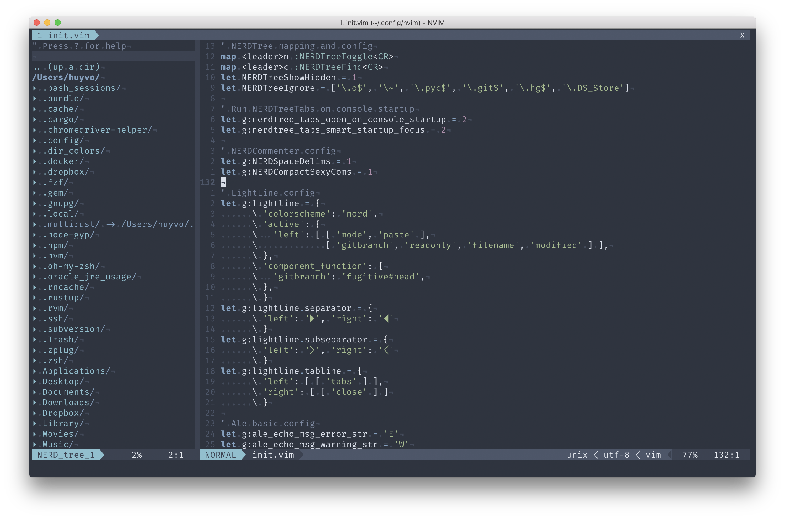

# dotfiles
A set of neovim, zsh, git, and tmux configuration files, made with blood sweat and tears.



## Prerequisites

- Neovim: https://github.com/neovim/neovim
- Vim-plug: https://github.com/junegunn/vim-plug
- Zsh + Oh My Zsh: https://github.com/robbyrussell/oh-my-zsh
- Tmux: https://github.com/tmux/tmux

## What I use

- **Font**: Fira Code 16px
- **Terminal**: iterm2 with Nord colorscheme
- **Searching tool**: The Silver Searcher
- **Command-line finder**: fzf
- **IRB customization**: awesome_print

## Installation

```
git clone git@github.com:huyvohcmc/dotfiles.git ~/.dotfiles
```

Create symlinks:

```
ln -s ~/.dotfiles/gitconfig ~/.gitconfig
ln -s ~/.dotfiles/zshrc ~/.zshrc
ln -s ~/.dotfiles/tmux.conf ~/.tmux.conf
ln -s ~/.dotfiles/init.vim ~/.config/nvim/init.vim
```
