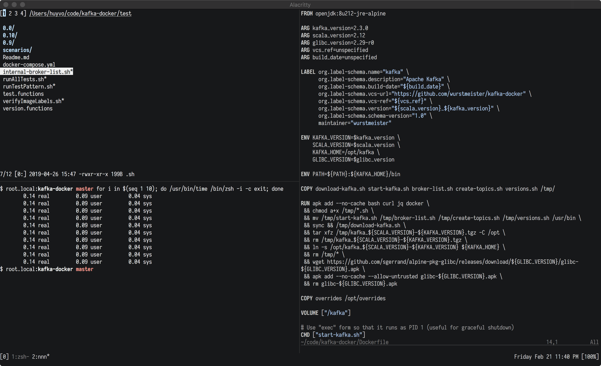

# Greetings, traveler!

This repository includes all of my opinionated configuration.

## Prerequisites

Assume that you already installed [homebrew](https://brew.sh/), [git](https://git-scm.com/), [zsh](https://github.com/robbyrussell/oh-my-zsh/wiki/Installing-ZSH), [rbenv](https://github.com/rbenv/rbenv), [nvm](https://github.com/nvm-sh/nvm), [neovim](https://neovim.io/), and [tmux](https://github.com/tmux/tmux).

## Installation

Clone this project at `$HOME`:

```sh
git clone git@github.com:huyvohcmc/dotfiles.git
cd dotfiles
```

Use Homebrew to install some necessary packages defined in `Brewfile`:

```sh
brew bundle
```

Create a backup of your existing dotfiles, remove them in `$HOME` and install the new ones using [stow](https://www.gnu.org/software/stow/):

```sh
make stow
```

To remove dotfiles:

```sh
make unstow
```

## Post-installation

Install [minpac](https://github.com/k-takata/minpac), then open `nvim` and install all plugins with `:PackUpdate`. You should also run `:checkhealth` to check your nvim condition.

Install [Tmux plugin manager](https://github.com/tmux-plugins/tpm) and press `prefix` + `I` inside a `tmux` session to fetch the plugins listed in `.tmux.conf`.

## Git configuration

To prevent people from accidentally committing under your name:

```sh
# ~/.gitconfig
[include]
  path = ~/.gitconfig.local
```

Where `~/.gitconfig.local` is simply:

```sh
[user]
  name = <your_name>
  email = <your_email>
```

I also use a `.gitmessage` template for co-authored commits on GitHub:

```sh
# ~/.gitmessage
Co-authored-by: Linus Torvalds <torvalds@transmeta.com>
```

```sh
# ~/.gitconfig
[commit]
  verbose = true
  template = ~/.gitmessage
```


## Zsh

I use [Zplugin](https://github.com/zdharma/zplugin) to manage Zsh plugins. The file `.zshrc` will automatically install Zplugin if it's not installed and then load the plugins. I use a customized version of the theme [Zeit](https://github.com/zeit/zeit.zsh-theme). The only difference between them is my version doesn't contain any `Oh-My-Zsh` functions.

## 0.14 milliseconds Zsh startup

```sh
$ for i in $(seq 1 10); do /usr/bin/time /bin/zsh -i -c exit; done
        0.14 real         0.09 user         0.04 sys
        0.14 real         0.09 user         0.04 sys
        0.14 real         0.09 user         0.04 sys
        0.14 real         0.09 user         0.04 sys
        0.14 real         0.09 user         0.04 sys
        0.14 real         0.09 user         0.04 sys
        0.14 real         0.09 user         0.04 sys
        0.14 real         0.09 user         0.04 sys
        0.14 real         0.09 user         0.04 sys
        0.14 real         0.09 user         0.04 sys
```

This can be achieved thanks to the [lazy-loading mechanism](https://htr3n.github.io/2018/07/faster-zsh/) applied to virtual environment loaders like `Rbenv` and `Nvm`:

```sh
# Rbenv
if [[ -s ~/.rbenv/shims/ruby ]]; then
  PATH=$HOME/.rbenv/shims:$PATH
fi
rbenv() {
  eval "$(command rbenv init - --no-rehash)"
  rbenv "$@"
}

# Nvm
export NVM_DIR=$HOME/.nvm
if [ -f $HOME/.nvm/alias/default ]; then
  PATH=${PATH}:${HOME}/.nvm/versions/node/v$(cat ~/.nvm/alias/default)/bin
fi
nvm() {
  [ -s $NVM_DIR/nvm.sh ] && source $NVM_DIR/nvm.sh
  nvm "$@"
}
```

## Iosevka

[Iosevka](https://github.com/be5invis/Iosevka) is one of the best font for programmers, it looks so good to the eye and supports ligatures. It also has many prebuilt variants, and if you build yourself you can customize the look of many different characters. Here is how I built an Iosevka version for my own:

1. Clone the repository
2. Ensure `nodejs` >= 8.4, `ttfautohint` and `otfcc` are installed
3. Install necessary libs by `npm install`
4. `npm run build -- contents::iosevka` (or `npm run build -- contents::iosevka-term` for term version)

Visit Iosevka's main repo for more build instructions.

## Screenshot or it didn't happen


## Inspired By

- [ahmedelgabri's dotfiles](https://github.com/ahmedelgabri/dotfiles)
- [justinmk's dotfiles](https://github.com/justinmk/config)
- [joshtronic's dotfiles](https://github.com/joshtronic/dotfiles)

and some other dotfiles on the internet.

## License

This repository is available under the [MIT license](./.github/LICENSE). Feel free to fork and modify the dotfiles as you please.
