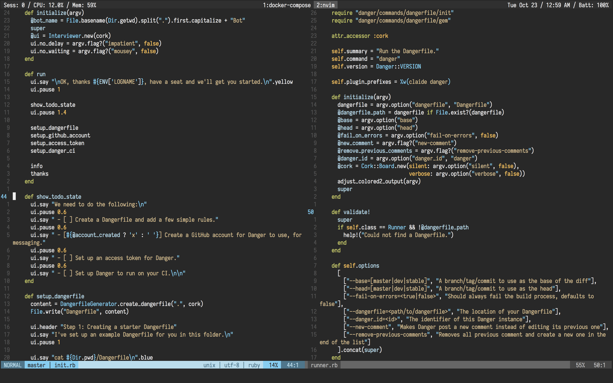

# Dotfiles are meant to be shared


<p align='center'>


</p>

-----

## Prerequisites

Make sure the following requirements are installed:

#### Homebrew

Install Homebrew, if you haven't: https://brew.sh.

Then use Homebrew to install some necessary packages defined in `Brewfile`:

```bash
$ brew bundle
```

#### ZSH

[The Z shell](https://github.com/robbyrussell/oh-my-zsh/wiki/Installing-ZSH), is an extended version of the Bourne Shell (sh), with plenty of new features, and support for plugins and themes.

#### RVM

RVM is a command-line tool which allows you to easily install, manage, and work with multiple ruby environments from interpreters to sets of gems. Install RVM: https://rvm.io.

#### NVM

Node Version Manager - Simple bash script to manage multiple active node.js versions. To install nvm: https://github.com/creationix/nvm.

## Installation

Clone this project (suppose you are at `$HOME`):

```bash
$ git clone git@github.com:huyvohcmc/dotfiles.git
```

Create a backup for your existing dotfiles and install the new ones ([stow](https://www.gnu.org/software/stow/) must be installed - see `Brewfile`):

```bash
$ cd dotfiles
$ make stow
```

To remove dotfiles:

```bash
$ make unstow
```

## Neovim

Install `vim-plug`, a minimalist Vim plugin manager: https://github.com/junegunn/vim-plug.

Then open `nvim` and install all plugins: `PlugInstall`. You should also run `:checkhealth` to check your `nvim` condition.

What's inside `init.vim`?

- [tender](https://github.com/jacoborus/tender.vim) - a 24bit colorscheme for Vim, Airline and Lightline
- [lightline](https://github.com/itchyny/lightline.vim) - a light and configurable statusline/tabline plugin for Vim
- [NERDTree](https://github.com/scrooloose/nerdtree) - a tree explorer plugin for Vim
- [fzf](https://github.com/junegunn/fzf.vim) - a command-line fuzzy finder for Vim
- [ALE](https://github.com/w0rp/ale) - asynchronous Lint Engine
- [polyglot](https://github.com/sheerun/vim-polyglot) - a solid language pack for Vim
- [ncm2](https://github.com/ncm2/ncm2) - completion framework for Neovim
- [gutentags](https://github.com/ludovicchabant/vim-gutentags) - a Vim plugin that manages your tag files
- [easymotion](https://github.com/easymotion/vim-easymotion) - vim motions on speed!
- [signify](https://github.com/mhinz/vim-signify) - show a diff using Vim its sign column
- [tcomment](https://github.com/tomtom/tcomment_vim) - comment vim-plugin
- [fugitive](https://github.com/tpope/vim-fugitive) - a git wrapper vim-plugin
- [rhubarb](https://github.com/tpope/vim-rhubarb) - GitHub extension for fugitive.vim
- [rails](https://github.com/tpope/vim-rails) - Ruby on Rails power tools
- [surround](https://github.com/tpope/vim-surround) - quoting/parenthesizing made simple
- [repeat](https://github.com/tpope/vim-repeat) - enable repeating supported plugin maps with "."
- [endwise](https://github.com/tpope/vim-endwise) - wisely add "end" in Ruby
- [targets](https://github.com/wellle/targets.vim) - plugin that provides additional text objects



## ZSH & Oh-My-Zsh

[Oh My Zsh](https://github.com/robbyrussell/oh-my-zsh) is a delightful community-driven framework for managing your zsh configuration.

Install [purer](https://github.com/DFurnes/purer), a ZSH prompt based on [pure](https://github.com/sindresorhus/pure):

```bash
$ npm install --global purer-prompt
```

`zshrc` is already set `purer` as the default prompt.

Oh-My-Zsh plugins included:

- git
- docker
- docker-compose
- zsh-autosuggestions
- history-substring-search

## Git

To prevent people from accidentally committing under your name:

```bash
# gitconfig
[user]
  # set in ~/.gitconfig_local
[include]
  path = ~/.gitconfig_local
```

Where `~/.gitconfig_local` is simply:

```bash
[user]
  name = Huy Vo
  email = huyvohcmc@gmail.com
```

I also use a `.gitmessage` template for co-authored commits on GitHub:

```bash
# ~/.gitmessage
Co-authored-by: Linus Torvalds <torvalds@transmeta.com>
```

## Iosevka

Install the fonts in `fonts/iosevka`:

```bash
$ cd fonts && ./install.sh
```

[Iosevka](https://github.com/be5invis/Iosevka) is one of the best font for programmers, it looks so good to the eye and supports ligatures. It also has many prebuilt variants, and if you build yourself you can customize the look of many different characters. Here is how I built an Iosevka version for my own:

1. Clone the repository
2. Ensure `nodejs` >= 8.4, `ttfautohint` and `otfcc` are installed
3. Install necessary libs by `npm install`
4. `npm run build -- contents:iosevka (--design:ligset-haskell)`

Visit Iosevka's main repo for more build instructions.

## Acknowledgement

- [thoughtbot's dotfiles](https://github.com/thoughtbot/dotfiles)
- [Mathias Bynens's dotfiles](https://github.com/mathiasbynens/dotfiles)
- [Adam Eivy's dotfiles](https://github.com/atomantic/dotfiles)
- [Drew Neil's dotfiles](https://github.com/nelstrom/dotfiles)
- [Kutsan Kaplan's dotfiles](https://github.com/kutsan/dotfiles)
- [Kris Leech's vimfiles](https://github.com/krisleech/vimfiles)
- [Amir Salihefendic's vimrc](https://github.com/amix/vimrc)

## License

This repository is available under the [MIT license](LICENSE). Do whatever the hell you want with it.
