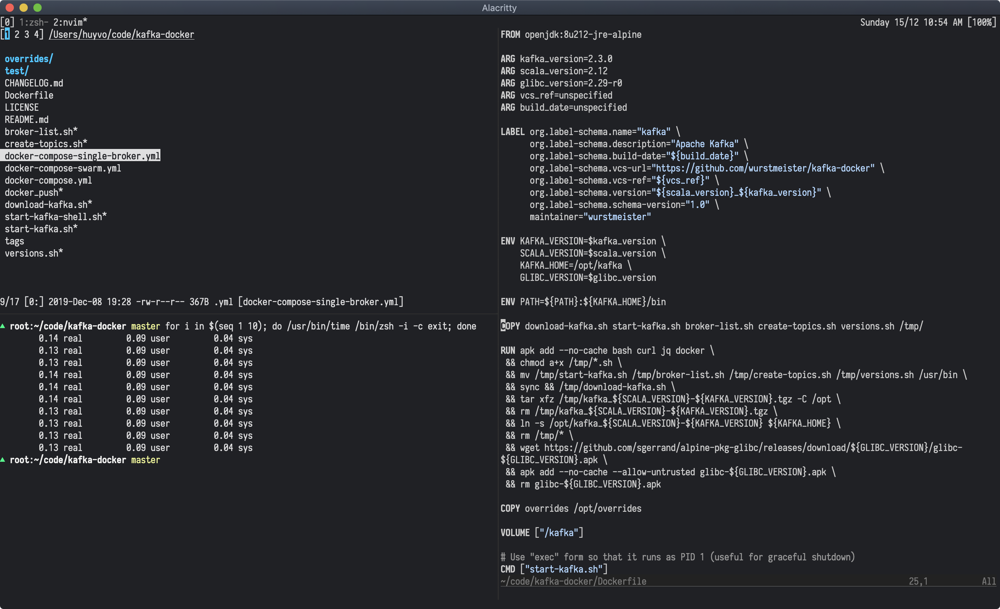

# Dotfiles for life

Enter the eternal laziness with a set of nvim, zsh, git and tmux configuration files.



## Prerequisites

- [Homebrew](https://brew.sh/)
- [Git](https://git-scm.com/)
- [Zsh](https://github.com/robbyrussell/oh-my-zsh/wiki/Installing-ZSH) and its framework [oh-my-zsh](https://github.com/robbyrussell/oh-my-zsh)
- [Rvm](https://rvm.io/)
- [Nvm](https://github.com/nvm-sh/nvm)
- [Neovim](https://neovim.io/)
- [Tmux](https://github.com/tmux/tmux)

## Installation

Clone this project at `$HOME`:

```sh
git clone git@github.com:huyvohcmc/dotfiles.git
cd dotfiles
```

Use Homebrew to install some necessary packages defined in `Brewfile`:

```sh
brew bundle
```

Create a backup of your existing dotfiles, remove them in `$HOME` and install the new ones using [stow](https://www.gnu.org/software/stow/):

```sh
make stow
```

To remove dotfiles:

```sh
make unstow
```

## Post-installation

Install [minpac](https://github.com/k-takata/minpac), then open nvim and install all plugins with `:PackUpdate`. You should also run `:checkhealth` to check your nvim condition.

Install [Tmux plugin manager](https://github.com/tmux-plugins/tpm) and press `prefix` + `I` inside a tmux session to fetch the plugins listed in `.tmux.conf`.

## Git Config

To prevent people from accidentally committing under your name:

```sh
# .gitconfig
[user]
  # set in ~/.gitconfig_local
[include]
  path = ~/.gitconfig_local
```

Where `~/.gitconfig_local` is simply:

```sh
[user]
  name = <your_name>
  email = <your_email>
```

I also use a `.gitmessage` template for co-authored commits on GitHub:

```sh
# ~/.gitmessage
Co-authored-by: Linus Torvalds <torvalds@transmeta.com>
```

## Iosevka

[Iosevka](https://github.com/be5invis/Iosevka) is one of the best font for programmers, it looks so good to the eye and supports ligatures. It also has many prebuilt variants, and if you build yourself you can customize the look of many different characters. Here is how I built an Iosevka version for my own:

1. Clone the repository
2. Ensure `nodejs` >= 8.4, `ttfautohint` and `otfcc` are installed
3. Install necessary libs by `npm install`
4. `npm run build -- contents::iosevka` (or `npm run build -- contents::iosevka-term` for term version)

Visit Iosevka's main repo for more build instructions.

## Acknowledgement

- [ahmedelgabri's dotfiles](https://github.com/ahmedelgabri/dotfiles)
- [justinmk's dotfiles](https://github.com/justinmk/config)
- [thoughtbot's dotfiles](https://github.com/thoughtbot/dotfiles)

## License

[](https://app.fossa.io/projects/git%2Bgithub.com%2Fhuyvohcmc%2Fdotfiles?ref=badge_large)

This repository is available under the [MIT license](LICENSE). Feel free to fork and modify the dotfiles as you please.
