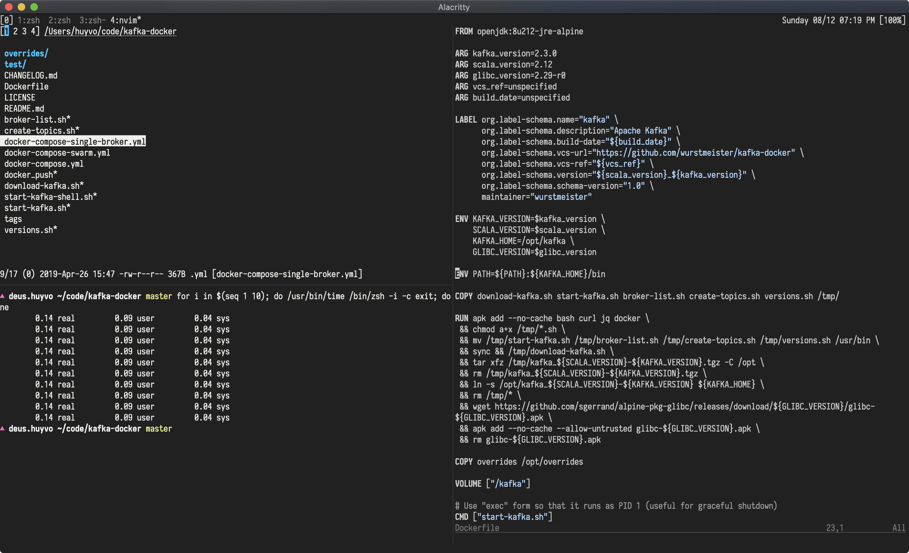

## Dotfiles are meant to be shared



[](https://forthebadge.com)
[](https://forthebadge.com)
[](https://forthebadge.com)
[](https://forthebadge.com)

## Prerequisites

Make sure the following requirements are installed:

### Homebrew

Install Homebrew, if you haven't: https://brew.sh.

Then use Homebrew to install some necessary packages:

- vim
- neovim
- tmux
- tmate
- git
- tig
- zsh
- universal-ctags
- the_silver_searcher

You can use the provided script to install the requirements:

```bash
$ ./brew.sh
```

### RVM

RVM is a command-line tool which allows you to easily install, manage, and work with multiple ruby environments from interpreters to sets of gems. Install RVM: https://rvm.io.

### NVM

Node Version Manager - Simple bash script to manage multiple active node.js versions. To install nvm: https://github.com/creationix/nvm.

### Oh My Zsh

[Oh My Zsh](https://github.com/robbyrussell/oh-my-zsh) is a ZSH framework, I will soon replace it with [prezto](https://github.com/sorin-ionescu/prezto).


## Installation

Clone this project (suppose you are at `$HOME`):

```bash
$ git clone git@github.com:huyvohcmc/dotfiles.git
```

Create a backup for existing dotfiles at `~/dotfiles.backup` and install the new ones:

```bash
$ cd dotfiles && ./bootstrap.sh
```

The bootstrap script support 3 arguments:

- `--install | -i` to symlink the dotfiles in this repo
- `--update | -u` to fetch the latest dotfiles from remote
- `--backup | -b` to backup the dotfiles and save to `~/.dotfiles.backup`

## Neovim

Install `vim-plug`, a minimalist Vim plugin manager: https://github.com/junegunn/vim-plug.

Then open `nvim` and install all plugins: `PlugInstall`. You should also run `:checkhealth` to check your `nvim` condition.

What's inside `init.vim`?

- [tender](https://github.com/jacoborus/tender.vim) - A 24bit colorscheme for Vim, Airline and Lightline
- [lightline](https://github.com/itchyny/lightline.vim) - A light and configurable statusline/tabline plugin for Vim
- [NERDTree](https://github.com/scrooloose/nerdtree) - A tree explorer plugin for Vim
- [fzf](https://github.com/junegunn/fzf.vim) - A command-line fuzzy finder for Vim
- [ALE](https://github.com/w0rp/ale) - Asynchronous Lint Engine
- [Polyglot](https://github.com/sheerun/vim-polyglot) - A solid language pack for Vim
- [nvim-completion-manager](https://github.com/roxma/nvim-completion-manager) - Completion framework for Neovim
- [Gutentags](https://github.com/ludovicchabant/vim-gutentags) - A Vim plugin that manages your tag files
- [Easymotion](https://github.com/easymotion/vim-easymotion) - Vim motions on speed!
- [Sandwich](https://github.com/machakann/vim-sandwich) - A plugin to add/delete/replace surroundings of text
- [Signify](https://github.com/mhinz/vim-signify) - Show a diff using Vim its sign column
- [Tcomment](https://github.com/tomtom/tcomment_vim) - Comment vim-plugin
- [Fugitive](https://github.com/tpope/vim-fugitive) - A Git wrapper vim-plugin
- [rhubarb](https://github.com/tpope/vim-rhubarb) - GitHub extension for fugitive.vim
- [Rails](https://github.com/tpope/vim-rails) - Ruby on Rails power tools

Note: you should install [rubocop](https://github.com/bbatsov/rubocop) and [eslint](https://github.com/eslint/eslint) so `ALE` can work properly:

```bash
$ gem install rubocop
$ npm install -g eslint
```

## ZSH

Install [purer](https://github.com/DFurnes/purer), a ZSH prompt based on [pure](https://github.com/sindresorhus/pure):

```bash
$ npm install --global purer-prompt
```

`zshrc` is already set `purer` as the default prompt.

Next, install [zsh-autosuggestions](https://github.com/zsh-users/zsh-autosuggestions) and [zsh-history-substring-search](https://github.com/zsh-users/zsh-history-substring-search):

```bash
$ brew install zsh-autosuggestions
$ brew install zsh-history-substring-search
```

Just like `purer`, these plugins are already set in `zshrc` so you don't need to do anthing else.

## Git

To prevent people from accidentally committing under my name:

```bash
# gitconfig
[user]
  # set in ~/.gitconfig_local
[include]
  path = ~/.gitconfig_local
```

Where `~/.gitconfig_local` is simply:

```bash
[user]
  name = Huy Vo
  email = huyvohcmc@gmail.com
```

I also use a `.gitmessage` template for co-authored commits on GitHub:

```bash
# ~/.gitmessage
Co-authored-by: Linus Torvalds <torvalds@transmeta.com>
```

## Iosevka

Install the fonts in `fonts/iosevka`:

```bash
$ cd fonts && ./install.sh
```

I built a customized version of [Iosevka](https://github.com/be5invis/Iosevka) because the original tff is too narrow for my eyes.

1. Clone the repository
2. Ensure `nodejs` >= 8.4, `ttfautohint` and `otfcc` are installed
3. Install necessary libs by `npm install`
4. Open `parameters.toml`, change the value of `width` to `550`
5. `make`

Visit `Iosevka` main repo for more build instructions.

## Will... will this work on Windows?


## Acknowledgement

- [thoughtbot's dotfiles](https://github.com/thoughtbot/dotfiles)
- [Mathias Bynens's dotfiles](https://github.com/mathiasbynens/dotfiles)
- [Adam Eivy's dotfiles](https://github.com/atomantic/dotfiles)
- [Drew Neil's dotfiles](https://github.com/nelstrom/dotfiles)
- [Kutsan Kaplan's dotfiles](https://github.com/kutsan/dotfiles)
- [Kris Leech's vimfiles](https://github.com/krisleech/vimfiles)
- [Amir Salihefendic's vimrc](https://github.com/amix/vimrc)

## License

This repository is available under the [MIT license](LICENSE). Do whatever the hell you want with it.
